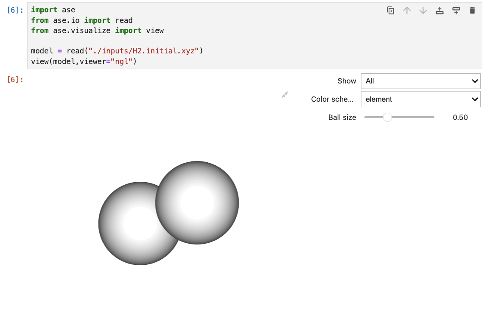

[🏠 Home](../ase.md)

# Visualization using Ase
ASEを用いた構造の視覚化は，`ase.visualize`を利用する．
使用方法は簡単で，まず初めに`ase.io.read`functionを用いて，instanceを定義して`ase.visualize`functionで可視化を行えば良いだけ．
```python
from ase.io import read            
from ase.visualize import view     
          
model = read("./inputs/H2.initial.xyz")
view(model,viewer="ngl")
```
<figure style="text-align:center;">
  
  <figcaption style="font-size:20px; margin-top:5px;">Fig: Image of view on jupyter-notebook</figcaption>
</figure>

Matlantisがマニュアルとして，[ASEの可視化](https://docs.matlantis.com/atomistic-simulation-tutorial/ja/Appendix_1_visualization.html)に関して紹介している．非常に参考になるので，参照されたし．

# `ase.io`を用いた可視化画像の保存方法
```python
# ASE base
from ase.io import write
from IPython.display import Image

write("output/tmp.png", atoms, rotation="0x,0y,0z")
Image(url="output/Si.png", width=200)
```

[🏠 Home](../ase.md)
