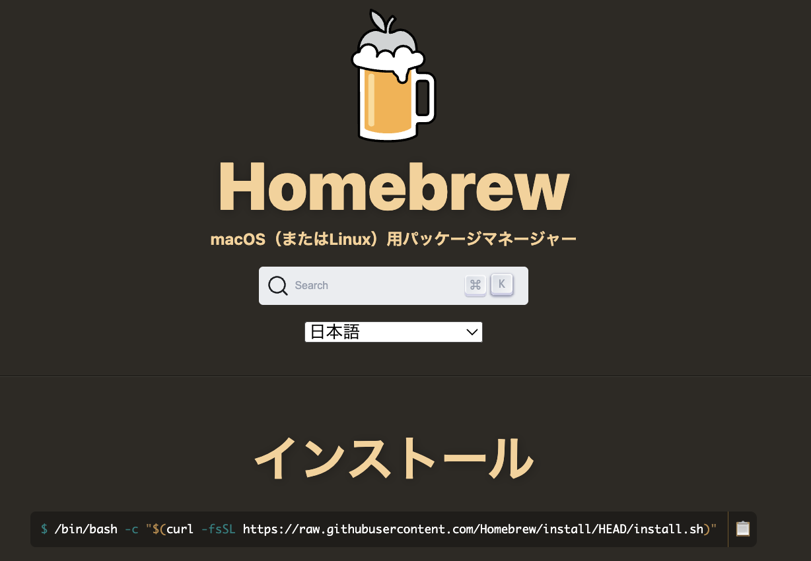

[🏠 Home](../environment.md)
# 🍺 Homebrewのインストール

##  Homebrewとは？

**Homebrew** は，macOS や Linux 向けの**パッケージマネージャ（パッケージ管理ソフト）**.
ターミナル上で簡単にソフトウェアのインストール・アップデート・アンインストールを行うことができ，開発境の構築やツールの管理を効率化することができる．

## インストール方法

[Homebrew](https://brew.sh/ja/) は macOS や Linux でパッケージ管理を行うためのツールであり，以下のコマンドで簡単にインストールできる．
<!---

--->
<figure style="text-align:center;">
  
  <figcaption style="font-size:20px; margin-top:5px;">Fig: Homebrew</figcaption>
</figure>

```bash
/bin/bash -c "$(curl -fsSL https://raw.githubusercontent.com/Homebrew/install/HEAD/install.sh)"
```

もし，インストールに失敗した場合などは，多くの場合 **Xcode のバージョンが古い**ことが原因と考えられる．Xcodeのアップデートを行ってみてください．

上記のコマンドを実行すると，Homebrewのインストールが始まります．インストール中にいくつかの質問が表示されることがありますが，基本的にはデフォルトの設定で進めて問題ありません. まず初めにパスワードの入力を求められます．これは，Homebrewが必要なディレクトリにアクセスするための権限を取得するためです．ご自身のmacのパスワードを入力してください．
インストールが進むと、必要な依存関係やツールが自動的にインストールされます．長い場合は数十分インストールに時間がかかることがあるので，しばらく待ちましょう．

Homebrew のインストールが完了したら，正しくインストールされているか以下のコマンドを入力して，確認してみてください．

```bash
brew doctor

# 正しくインストールされている場合、以下のようなメッセージが表示されます。
# Your system is ready to brew.
```
#### 実行例
```bash
brew doctor
# Your system is ready to brew.

# wgetのインストール
brew install wget

# gnuplotのインストール
brew install gnuplot

# pyenvのインストール
brew install pyenv

# gitのインストール
brew install git

# git-openのインストール
brew install git-open

# インストールしされたパッケージの確認
brew list
# インストールされたパッケージのアップデート
brew update
```


## ✅ 特徴

- **簡単なコマンド**でソフトウェアをインストール（例：`brew install python`）
- macOS 標準の環境に影響を与えにくい
- オープンソースで活発にメンテナンスされている
- `brew install`, `brew update`, `brew uninstall` など直感的なコマンド体系
- CUIツールだけでなくGUIアプリ（例：Google Chrome）も `brew install --cask` で管理可能

## 🔧 よく使うコマンド

| 操作 | コマンド例 |
|------|-------------|
| パッケージのインストール | `brew install git` |
| GUIアプリのインストール | `brew install --cask google-chrome` |
| パッケージの更新 | `brew upgrade` |
| Homebrew自体の更新 | `brew update` |
| パッケージのアンインストール | `brew uninstall git` |
| インストール済み一覧の表示 | `brew list` |

---

## 💡 補足

- Homebrew は `/opt/homebrew`（Apple Silicon）または `/usr/local`（Intel Mac）にインストールされる．
- Homebrew でインストールしたツールは，システムの Python や Git などと**競合せずに並行して使用**できる．
- 開発環境をコードベースで再現したい場合にも便利（例：`brew bundle`）


---
### Gitのインストール
Gitはバージョン管理システムで、ソースコードの管理に使用されます。以下のコマンドでインストールできます。

#### macOSの場合
macにはdefaultでGitがインストールされていますが、最新バージョンを使用するためにHomebrewを使ってインストールすることをお勧めします。
```bash
brew install git
```

[🏠 Home](../environment.md)
