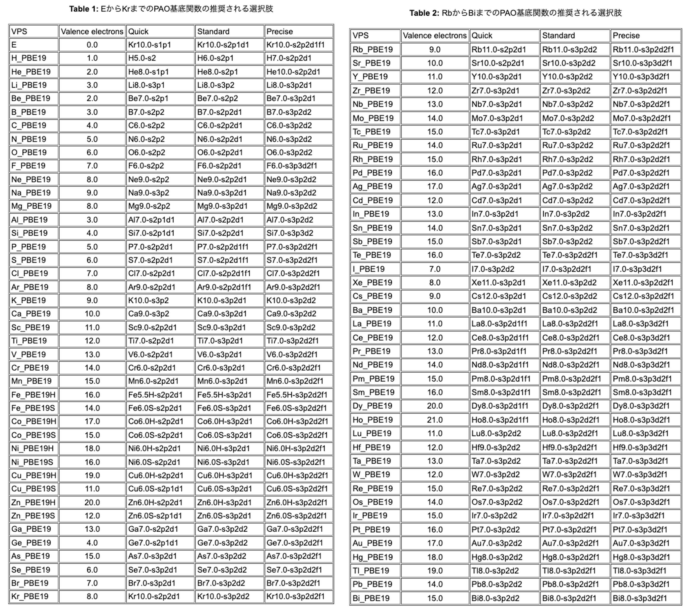

[🏠 Home](03_permanent_notes/250605_cd-mb/environment_setting/doc/openmx/openmx.md)

# 基本的なパラメタ設定の勘所・収束のスキル
<a id="基本的なパラメタ設定の勘所・収束のスキル"></a>

OpenMX における重要なパラメタを以下に列挙し，順に説明していく:
## ✅ 比較的重要なパラメタの一覧
 - 擬ポテンシャル (Definition.of.Atomic.Species)
     - **従来型擬ポテンシャル**
     - オープンコア型擬ポテンシャル
     - 内殻準位励起のための擬ポテンシャル
 - 有効擬原子基底 (Definition.of.Atomic.Species)
     - Quick
     - **Standard**
     - Precise
 - 交換相関エネルギー(scf.XcType)
     - LDA
     - LSDA-CA
     - LSDA-PW
     - **GGA-PBE**
 - カットオフエネルギー（scf.energycutoff）
 - 電子温度 （scf.ElectronicTemperature）
 - K空間メッシュ （scf.Kgrid）
 - Kohn-Sham方程式のバンドエネルギートータル差分の収束条件 (scf.criterion)

Kohn-Sham方程式の自己無撞着計算(SCF, self-consistent field)に関連するパラメタは，`scf.###`という入力パラメタ変数が採用されている．一方で，構造最適化やNEB計算などの原子座標を動かす計算に関連するパラメタは,`MD.###`という入力パラメタ変数が採用されている．
**そのため，SCF計算で問題が生じた場合は`scf.###`パラメタを，MD計算に問題が生じた場合は`MD.###`パラメタをそれぞれ精査することが，計算エラー解決のための一つの有効な指針になる．**

## 📄 パラメタの詳細

- *擬ポテンシャル*  
    擬ポテンシャルは，入力パラメタ`Definition.of.Atomic.Species`の1列目で定義する．
    擬ポテンシャルの選択肢には，従来型擬ポテンシャル，オープンコア型擬ポテンシャル，内殻準位励起のための擬ポテンシャルの3種類がある．基底状態の計算には，従来型の擬ポテンシャルを用いれば良い．
    図1はOpenMXの[website](https://www.openmx-square.org/openmx_man3.9jp/node27.html)から持ってきたものであり，Table1,2のVPS欄を参照して選択するとよい．

- *有効擬原子軌道*  
    有効擬原子軌道は，入力パラメタ`Definition.of.Atomic.Species`の２列目で定義する．
    有効擬原子軌道は，すでにベンチマーク計算（図1参照）により最適化された[データベース](https://www.openmx-square.org/openmx_man3.9jp/node27.html)が提供されているので，そちらを利用するとよい．基本はStandardの利用で良い．

- *交換相関エネルギー*  
    交換相関エネルギーは，入力パラメタ`scf.XcType`で定義する．
    交換相関エネルギーには，GGA-PBEかLDAの選択を初めての計算では利用しすると良い．

- [*カットオフエネルギー*](https://www.openmx-square.org/openmx_man3.8jp/node37.html)  
    カットオフエネルギーは，入力パラメタ`scf.energycutoff`によって制御される．私の経験では，`200~250 Ry`程度の値を用いることで，多くの系は十分な収束が得られる印象である．
    **特に構造最適化計算においては重要なパラメタであり，値を大きく設定することで計算の収束性が向上する場合がある．**
    これは，カットオフエネルギーの値が小さいと実空間メッシュが粗くなり，その結果として原子位置が最適化プロセス中に振動しやすくなるためである．

- *電子温度*  
    電子温度は，入力パラメタ`scf.ElectronicTemperature`で定義する．
    Kohn-Sham方程式の自己無撞着計算では，Fermiエネルギー近傍でのバンドの取り扱いには工夫が必要である．初めての計算では，電子温度は300K程度で計算をすることを推奨．

- *K空間メッシ*  
    K空間メッシュは，入力パラメタ`scf.KGrid`で定義される．
    K空間メッシュは，k-spaceにおける格子の差分を定義しており，セルの大きい系や構造最適化計算には関与しない．今回は説明を省略（2025.04.21:いづれ追記する）．

- *Kohn-Sham方程式のバンドエネルギーのトータル差分についての，収束条件*  
    Kohn-Sham方程式のSCF計算の収束条件は，入力パラメタ`scf.criterion`によって定義される．
Default値は`1.0E-6 [Hrtree]`．基本的に，デフォルト値よりも深い値を設定したほうが良い．`1.0 [Hartree] = 27.21 [eV]`である．仮に`100`原子のモデルを考えた際に，`1.0E-3 [eV]`のオーダーまで収束させたい場合は，以下のような概算を行なうことで，citerioaの値の定義の概算を算出できる．

$$ \rm{eV}における欲しい精度の桁数 /(原子数\times 30) [\rm{Hartree}] $$
$$= 1.0\times 10^{-3}/(100\times 30) [\rm{Hartree}]\simeq 1.0\times 10^{-7} [Hartree]$$

- *Kohn-Sham方程式の自己無撞着計算の際の電子密度推定のパラメタ*   
    Kohn-Sham方程式の自己無撞着計算(SCF)では，電子密度を更新する必要がある．
    電子密度は，Kohn-Sham方程式の解を求めるために必要な物理量であり，その更新はSCF計算の重要なステップである．
    OpenMXでは，電子密度の更新方法を`scf.Mixing.Type`で定義し，その混合比を`scf.###.Mixing.Weight`で定義する.
    具体的には，`scf.Mixing.Type`は電子密度の更新手法を意味し，`scf.###.Mixing.Weight`は電子密度の混合比を定義する．
    電子密度の更新は，SCF計算の各ステップで行われ，過去の電子密度と新しい電子密度を混合して新しい電子密度を作成する．
    これにより，汎函数理論の枠組みから交換相関ポテンシャルが作成され，再びKohn-Sham方程式が解かれる．
    電子密度の更新は，SCF計算の収束性に大きな影響を与えるため、適切なパラメタ設定が重要である．
    `scf.Mixing.StartPulay`は[比較的大きめに設定することが推奨されており](https://www.openmx-square.org/openmx_man3.8jp/node42.html)，
    混合の開始時期を調整することができる．

    ```
    # -----------------------------------------------------------
    # Example of mixing parameters for Update of electron density
    # -----------------------------------------------------------

    scf.Mixing.Type               rmm-diisk # 基本) rmm-diiskを使用
    scf.Init.Mixing.Weight        0.05      # 初期の電子密度の混合比
    scf.Min.Mixing.Weight         0.01      # 混合比の最小比
    scf.Max.Mixing.Weight         0.30      # 混合比の最大比
    scf.Mixing.History            25        # 混合時の参照履歴の定義
    scf.Mixing.StartPulay         15        # 気にしない（他パラメタチューニングでうまくいく）
    ```

<figure style="text-align:center;">
  
  <figcaption style="font-size:20px; margin-top:5px;">図1: OpenMX VPS & PAO Tables</figcaption>
</figure>

[🏠 Home](03_permanent_notes/250605_cd-mb/environment_setting/doc/openmx/openmx.md)
