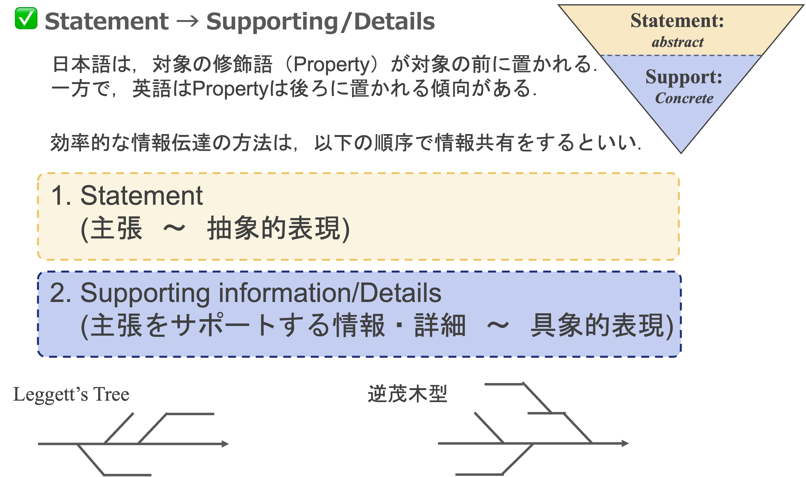

[🏠 Home](../../README.md)

# 情報伝達・コミュニケーションの指針

効率的かつ説得力のある情報伝達を行うための，構造化のルールをまとめる．
自分用

---

## 1. 抽象から具体へ（Statement → Supporting Info）
「結論から話す」原則を意識．

* **Statement（主張・結論）:** * 最初に伝える．抽象度が高く，メッセージ性が強いもの．
    * 聞き手が「何の話か」を即座に理解できる枠組みを提供する．
* **Supporting Information / Details（根拠・詳細）:** * 主張の後に記述する．Statementよりも抽象度が低く，具体的な事実やデータ．
    * 「なぜその結論になるのか？」という問いに答える形で構成する．

## 2. 視覚的エビデンス（Graphical Imageによる証明）
言語的な主張（Statement）には，必ずそれを裏付ける視覚的根拠をセットにする．

* **役割:** Graphical Image（図表・グラフ・写真）は，Statementを証明するための客観的証拠．
* **整合性:** 「図で見れば一目で納得できる」状態を作る．Statementと図のメッセージが1対1で対応していることが重要．
* **エビデンス主義:** 主張には必ず「証拠（Evidence）」を添える習慣をつける．

## 3. 意思決定を促す構成（空・雨・傘：状況 → 解釈 → 提案）
単なる事実の羅列（Fact-only）を避け，情報の活用・アクションを意識した共有を行う．

* **状況（空）:** 「空が曇っている」＝ 客観的事実（Fact）．
* **予想・解釈（雨）:** 「雨が降りそうだ」＝ 事実から導き出される予測・洞察（Insight/So What?）．
* **提案・行動（傘）:** 「傘を持っていくべきだ」＝ 予測に基づく具体的なアクション（Suggestion/Action）．

> **Note:** > 情報を伝えるだけで終わると，相手に「So What?（だから何？）」と思われてしまう．
> 常に「この情報を使って今後の方針」という**Suggest（提案）**までを含める．

---

[🏠 Home](../../README.md)
