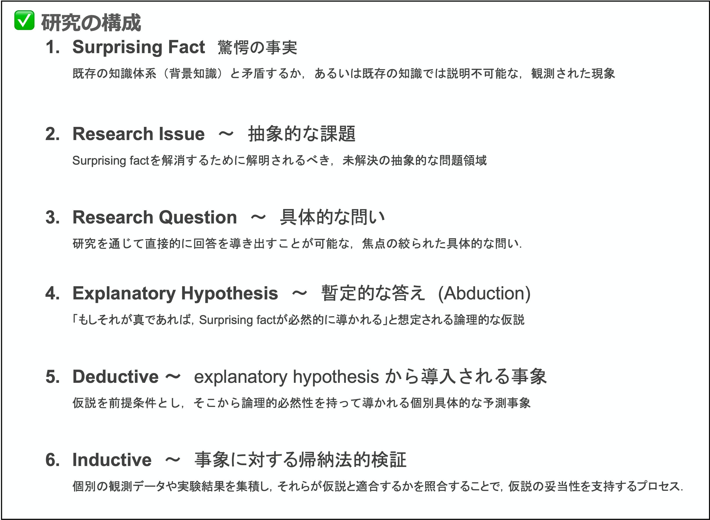

[🏠 Home](../../README.md)
**自分用ノート**

# Research Design：パースのアブダクションに基づく探究プロセス

## 【結論】探究とは「驚き」を「当然」に変える循環である
科学的探究の本質は、既存の理論では説明できない**驚愕の事実**を起点とし、**アブダクション（仮説形成）**、**演繹（予測）**、**帰納（検証）**のサイクルを通じて理論を洗練させていくプロセスである。

---

## 1. 探究の出発点：問いの同定と定式化
探究を駆動させるためには、単なる観察を学術的な「問い」へと昇華させる必要がある。

### 驚愕の事実（Surprising Fact）の同定
* **定義**: 背景知識（既存理論）や常識を裏切り、「本来こうあるべきだ」という予測から逸脱した観察結果 $C$ を指す。
* **アクション**: 何が「驚き」なのかを言語化し、矛盾する既存理論を特定する。
* **理論的視点**: これは後退法的推論（Backward Method）の起点であり、未知の法則を示唆するシグナルである。

### 研究課題（Research Issue）の定式化
* **目的**: 現象 $C$ の解明が持つ理論的・実用的意義を客観的に定義する。
* **アクション**: 問いをリサーチ・ギャップの中に位置づけ、具体的な「Research Question」へと具象化する。

---

## 2. 仮説の創出と具体化
問いに対し、論理的な飛躍を伴う洞察（Insight）を用いて答えの候補を提示するステップである。

### 説明仮説の形成（Abduction）
* **推論形式**: 「驚愕の事実 $C$ がある。もし仮説 $A$ が真なら $C$ は当然の事柄となる。ゆえに $A$ が真であると疑う理由がある」という形式をとる。
* **良い仮説の4条件**: 
    * **Plausibility（もっともらしさ）**: 直感的な妥当性があること。
    * **Verifiability（検証可能性）**: 偽証や確認が可能であること。
    * **Simplicity（単純性）**: 説明が簡潔であること。
    * **Economy（経済性）**: 追求コストが妥当であること。

### 演繹的予測（Deduction）
* **目的**: 抽象的な仮説 $A$ を、経験的にテスト可能な形式（予測）へ変換する。
* **アクション**: 「もし $A$ が正しいなら、条件 $X$ のもとで結果 $Y$ が得られるはずだ」という命題を導き出す。

---

## 3. 経験的検証と洗練（Induction）
導き出された予測を現実世界で照らし合わせ、仮説の確からしさを評価する。

* **検証プロセス**: 実験、フィールド調査、データ分析等、予測を評価するのに最適な手法を実行する。
* **評価の分岐**: 
    * **支持された場合**: 仮説 $A$ の確からしさ（Plausibility）が高まり、理論として強化される。
    * **支持されなかった場合**: 仮説を修正するか、新たな「驚愕の事実」としてステップ1へ再投入する。

---

## 【まとめ】探究の構造的サイクル
研究デザインは以下の論理鎖を繰り返すことで深化する。

$${\rm Surprising\ fact} \rightarrow {\rm Explanatory\ hypothesis} \rightarrow {\rm Abduction} \rightarrow {\rm Deduction} \rightarrow {\rm Induction}$$

* **アブダクション**: 驚愕の事実から仮説を「創出」する。
* **演繹**: 仮説からテスト可能な予測を「導出」する。
* **帰納**: 実際のデータで仮説を「検証」する。

[🏠 Home](../../README.md)
