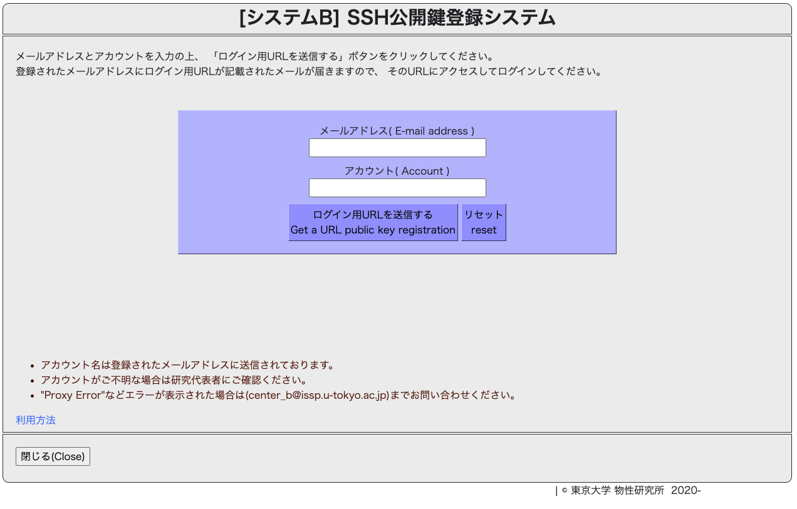
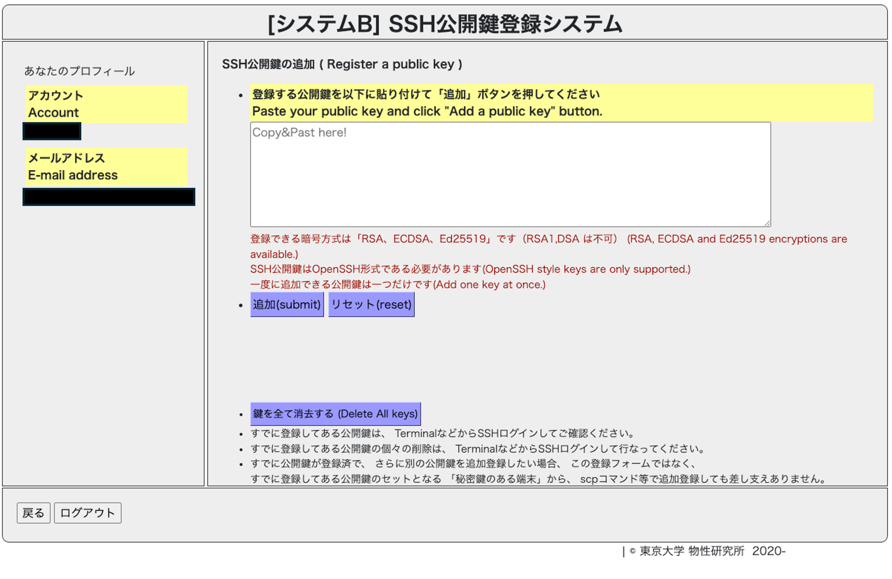

[🏠 Home](systemb.md)

# 物性研 SystemB へのログイン方法

大規模計算の実行には，一般に外部計算機を利用する．ここでは物性研 [systemB Ohtaka](https://mdcl.issp.u-tokyo.ac.jp/scc/system/systembinfo) でアカウントを取得した場合の簡単なログイン方法と，Quesub systemの利用と並列化に関して記述する．

systemB ohtaka の入門マニュアルは，[website](https://mdcl.issp.u-tokyo.ac.jp/scc/system/systembinfo/manual) で入手可能であるので各自で参考にすると利用がスムーズになる:特に，[利用の手引き](https://mdcl.issp.u-tokyo.ac.jp/scc/manual-B/SystemB_User%27s_Guide_Rev2.7_JP.pdf)と[利用講習会のスライド](https://mdcl.issp.u-tokyo.ac.jp/scc/manual-B/ISSP20201127_B_Dell.pdf)では，頻繁に使うコマンドがまとめて紹介されており，初学者には参考になる．

### ssh 接続を行うための公開鍵の登録．
利用者登録が完了すると，各登録メールアドレス宛にSSH公開鍵登録システムへのURLが送られてくる（図2参照）．これらのwebsiteの指示にしたがって，SSH公開鍵の登録をすすめる（図3）．
ssh鍵の登録は，Qiitaの記事などを参考にすると良い．**注意しべき点として，決して秘密鍵の登録をしないようにお願いします．**

- [Mac用](https://qiita.com/soma_sekimoto/items/35845495bc565c38ae9d)
- [Windos用](https://qiita.com/digdagdag/items/9e5c061e7d86e0af9a57)

<figure style="text-align:center;">
  
  <figcaption style="font-size:20px; margin-top:5px;">図2: 公開鍵登録システムログイン画面</figcaption>
</figure>

<figure style="text-align:center;">
  
  <figcaption style="font-size:20px; margin-top:5px;">図3: 公開鍵登録画面</figcaption>
</figure>

鍵の登録後，sshでのアクセスが可能となる．ログイン方法は以下のコマンドをターミナルソフト上で入力：
``` zsh
ssh -l {username} ohtaka.issp.u-tokyo.ac.jp
or
ssh {username}@ohtaka.issp.u-tokyo.ac.jp
or
ssh -i{ssh-key_path} {username}@ohtaka.issp.u-tokyo.ac.jp
```
Windows利用者は，可能であれば Windows Terminal + WSL のセットアップを推奨．
個人的には，[Windows Terminal + WSL](https://www.nedia.ne.jp/blog/tech/2022/06/07/19314)環境下で，Linuxコマンドを使えるようにすると便利だと思う．

[🏠 Home](systemb.md)
